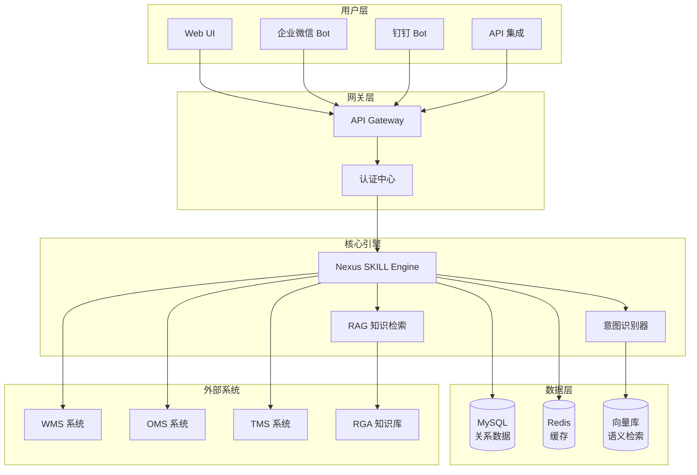
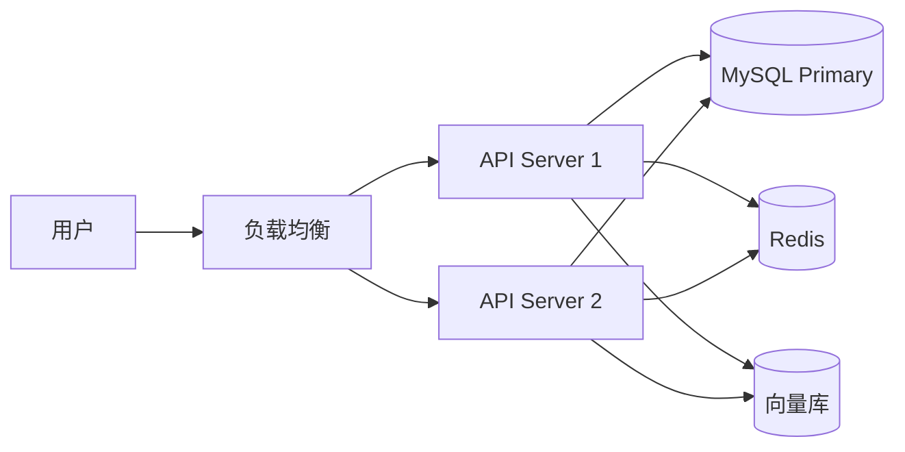

# 系统架构设计

## 1. 系统定位与目标

### 1.1 系统定位

RGA（Rediscover Knowledge Base + AI Gateway）是 AI 中台智能体 **Nexus** 的核心知识引擎，为内部员工提供数据驱动的业务决策支持。

### 1.2 系统目标

| 目标 | 描述 |
|------|------|
| 知识整合 | 汇聚 SOP、政策、FAQ、行业知识于一体 |
| 智能检索 | 基于语义匹配，精准返回答案 |
| 决策支持 | 结合实时数据，提供可执行建议 |
| 权限安全 | 分级管控，确保信息安全 |

---

## 2. 功能模块划分

### 2.1 核心模块

```
┌─────────────────────────────────────────────────────────────┐
│                      RGA 知识平台                             │
├─────────────────────────────────────────────────────────────┤
│  ┌───────────┐  ┌───────────┐  ┌───────────┐  ┌───────────┐ │
│  │  用户层   │  │  SKILL   │  │  知识库   │  │  生产系统 │ │
│  │  (UI/API) │  │   引擎   │  │   (RAG)  │  │ (WMS/OMS)│ │
│  └─────┬─────┘  └─────┬─────┘  └─────┬─────┘  └─────┬─────┘ │
│        │              │              │              │        │
│        └──────────────┴──────────────┴──────────────┘        │
│                           │                                  │
│                    ┌──────┴──────┐                           │
│                    │   业务逻辑层  │                           │
│                    └──────┬──────┘                           │
│                           │                                  │
│                    ┌──────┴──────┐                           │
│                    │   数据存储层  │                           │
│                    └─────────────┘                           │
└─────────────────────────────────────────────────────────────┘
```

### 2.2 模块职责

| 模块 | 职责 |
|------|------|
| **用户层** | 接收员工请求、返回响应、权限验证 |
| **SKILL 引擎** | 技能匹配、参数校验、决策生成 |
| **知识库 (RAG)** | 文档检索、语义匹配、知识更新 |
| **生产系统** | WMS/OMS/TMS 实时数据查询 |
| **业务逻辑层** | 流程编排、数据聚合、结果处理 |
| **数据存储层** | MySQL、Redis、向量数据库 |

---

## 3. 技术架构

### 3.1 技术栈

| 层级 | 技术选型 |
|------|---------|
| API 层 | RESTful API / GraphQL |
| 业务逻辑层 | Node.js / Python FastAPI |
| 数据存储 | MySQL 8.0 + Redis + Elasticsearch |
| 向量检索 | Milvus / Qdrant（可选） |
| 缓存层 | Redis Cluster |
| 消息队列 | RabbitMQ / Kafka |

### 3.2 系统架构图



---

## 4. 知识体系架构

### 4.1 三层知识架构

```
┌─────────────────────────────────────────────────────────────┐
│                     平台层（全局共享）                          │
│         快递公司 · 电商平台 · 海关政策 · 物流方案               │
├─────────────────────────────────────────────────────────────┤
│                     公司层（租户隔离）                          │
│         公司资料 · 产品信息 · 客户信息 · SOP · 报价规则          │
├─────────────────────────────────────────────────────────────┤
│          订单层                    │       用户层              │
│   待处理 · 执行中 · 已完成 · 异常    │   个人话术 · 常用模板     │
└─────────────────────────────────────────────────────────────┘
```

### 4.2 权限模型

| 层级 | 可见范围 |
|------|---------|
| **平台层** | 全部可见（所有公司、所有员工用户） |
| **公司层** | 仅该公司可见（员工 + 用户） |
| **订单层** | 仅该公司可见，按订单阶段隔离 |
| **用户层** | 仅本人可见，支持公司授权共享 |

### 4.3 SKILL 与知识层映射

详见《08 检索引擎设计》

---

## 5. 数据流向设计

### 5.1 请求处理流程

```
员工输入
    │
    ▼
意图识别 ─────────────────────────────────────┐
    │                                          │
    ▼                                          │
参数提取                                          │
    │                                          │
    ├─── 参数完整？ ──否──▶ 请求补充参数 ──────────┤
    │                       ▲                   │
    │                       │                   │
    ▼                       │                   │
技能匹配 ─────────────────────────────────────┤
    │                                          │
    ▼                                          │
执行 SKILL ────────────────────────────────────┤
    │                                          │
    ├─── 调用 TMS Tool ──▶ 公司层/订单层 ──────────┤
    │                                          │
    ├─── 调用生产系统 ──▶ WMS/OMS 查询 ──────────┤
    │                                          │
    └─── 知识检索 ──▶ 三层知识库（RAG）─────────┤
                                              │
    ▼                                          │
结果生成                                          │
    │                                          │
    ▼                                          │
响应输出 ←──────────────────────────────────────┘
```

---

## 6. 安全架构

### 5.1 认证授权

| 机制 | 说明 |
|------|------|
| 员工认证 | 企业 SSO / OAuth 2.0 |
| 角色权限 | 销售 / 客服 / 仓库 / 研发 / 管理员 |
| 数据权限 | 按角色过滤可访问数据范围 |
| 操作审计 | 完整操作日志，记录到 AUDIT_LOG |

### 5.2 数据安全

- 客户敏感信息脱敏（手机号、身份证）
- 批量数据导出需二次确认
- 外部引用信息需标注来源

---

## 7. 部署架构



---

## 8. 性能指标（目标）

| 指标 | 目标值 |
|------|--------|
| API 响应时间 | P95 < 500ms |
| 知识检索召回率 | > 90% |
| 系统可用性 | 99.9% |
| 并发支持 | 500+ QPS |
