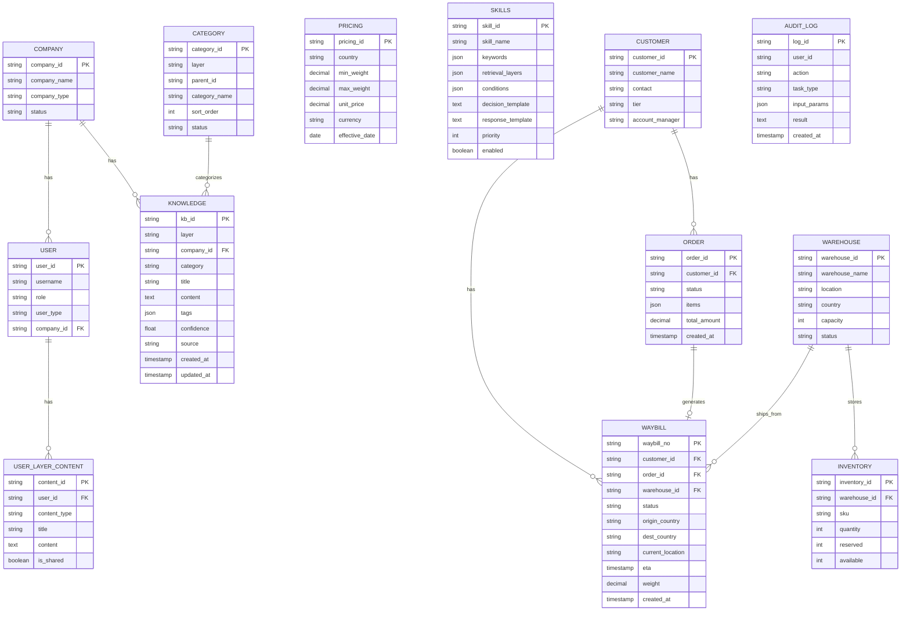
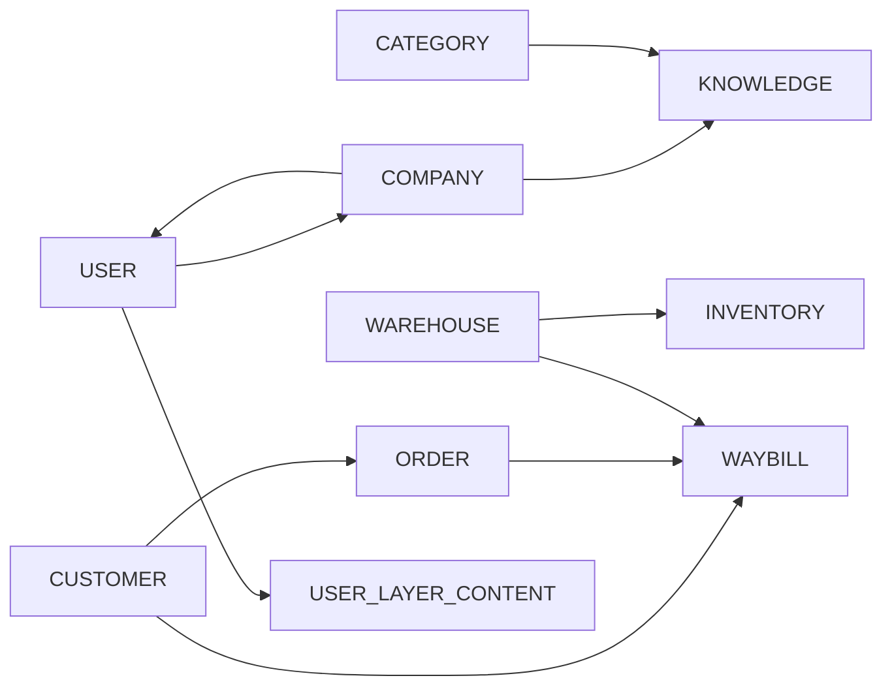

# 数据库设计

## 1. ER 图

---

## 2. 数据表清单

| 序号 | 表名 | 说明 |
|------|------|------|
| 1 | `USER` | 用户表 |
| 2 | `COMPANY` | 公司表 |
| 3 | `CUSTOMER` | 客户信息 |
| 4 | `ORDER` | 订单 |
| 5 | `WAYBILL` | 运单 |
| 6 | `WAREHOUSE` | 仓库 |
| 7 | `INVENTORY` | 库存 |
| 8 | `PRICING` | 报价规则 |
| 9 | `SKILLS` | 技能配置 |
| 10 | `KNOWLEDGE` | 知识库 |
| 11 | `AUDIT_LOG` | 操作日志 |
| 12 | `CATEGORY` | 知识分类表 |
| 13 | `USER_LAYER_CONTENT` | 用户层内容表 |

---

## 3. 表结构详细设计

### 3.1 CUSTOMER（客户表）

| 字段 | 类型 | 约束 | 说明 |
|------|------|------|------|
| `customer_id` | VARCHAR(32) | PK | 客户ID |
| `customer_name` | VARCHAR(128) | NOT NULL | 客户名称 |
| `contact_name` | VARCHAR(64) | | 联系人 |
| `contact_phone` | VARCHAR(20) | | 联系电话（脱敏存储） |
| `contact_email` | VARCHAR(128) | | 邮箱 |
| `tier` | ENUM('VIP','NORMAL','TRIAL') | DEFAULT 'NORMAL' | 客户等级 |
| `account_manager` | VARCHAR(64) | | 客户经理 |
| `credit_limit` | DECIMAL(12,2) | DEFAULT 0 | 信用额度 |
| `status` | ENUM('ACTIVE','SUSPENDED','CANCELLED') | DEFAULT 'ACTIVE' | 状态 |
| `created_at` | TIMESTAMP | DEFAULT CURRENT_TIMESTAMP | 创建时间 |
| `updated_at` | TIMESTAMP | ON UPDATE CURRENT_TIMESTAMP | 更新时间 |

**索引：**
- `idx_tier` ON `tier`
- `idx_status` ON `status`
- `idx_account_manager` ON `account_manager`

---

### 3.2 ORDER（订单表）

| 字段 | 类型 | 约束 | 说明 |
|------|------|------|------|
| `order_id` | VARCHAR(32) | PK | 订单ID |
| `customer_id` | VARCHAR(32) | FK | 客户ID |
| `order_no` | VARCHAR(64) | UNIQUE | 订单编号 |
| `status` | ENUM('PENDING','CONFIRMED','PROCESSING','SHIPPED','COMPLETED','CANCELLED') | DEFAULT 'PENDING' | 状态 |
| `order_type` | ENUM('B2B','B2C','C2C') | | 订单类型 |
| `items` | JSON | NOT NULL | 订单明细 |
| `total_amount` | DECIMAL(12,2) | | 总金额 |
| `currency` | VARCHAR(8) | DEFAULT 'CNY' | 币种 |
| `receiver_name` | VARCHAR(128) | | 收货人 |
| `receiver_phone` | VARCHAR(20) | | 收货电话 |
| `receiver_address` | TEXT | | 收货地址 |
| `receiver_country` | VARCHAR(32) | | 收货国家 |
| `remarks` | TEXT | | 备注 |
| `created_at` | TIMESTAMP | DEFAULT CURRENT_TIMESTAMP | 创建时间 |
| `updated_at` | TIMESTAMP | ON UPDATE CURRENT_TIMESTAMP | 更新时间 |

**索引：**
- `idx_customer_id` ON `customer_id`
- `idx_status` ON `status`
- `idx_created_at` ON `created_at`

---

### 3.3 WAYBILL（运单表）

| 字段 | 类型 | 约束 | 说明 |
|------|------|------|------|
| `waybill_no` | VARCHAR(32) | PK | 运单号 |
| `customer_id` | VARCHAR(32) | FK | 客户ID |
| `order_id` | VARCHAR(32) | FK | 订单ID |
| `warehouse_id` | VARCHAR(32) | FK | 仓库ID |
| `status` | ENUM('CREATED','PICKED','IN_TRANSIT','OUT_FOR_DELIVERY','DELIVERED','EXCEPTION','RETURNED') | DEFAULT 'CREATED' | 状态 |
| `origin_country` | VARCHAR(32) | | 原产地 |
| `dest_country` | VARCHAR(32) | | 目的地 |
| `current_location` | VARCHAR(256) | | 当前节点 |
| `current_status_desc` | VARCHAR(256) | | 状态描述 |
| `eta` | TIMESTAMP | | 预计到达 |
| `actual_delivery_time` | TIMESTAMP | | 实际到达 |
| `weight` | DECIMAL(10,3) | | 重量(KG) |
| `length` | DECIMAL(10,2) | | 长(CM) |
| `width` | DECIMAL(10,2) | | 宽(CM) |
| `height` | DECIMAL(10,2) | | 高(CM) |
| `shipping_fee` | DECIMAL(10,2) | | 运费 |
| `created_at` | TIMESTAMP | DEFAULT CURRENT_TIMESTAMP | 创建时间 |
| `updated_at` | TIMESTAMP | ON UPDATE CURRENT_TIMESTAMP | 更新时间 |

**索引：**
- `idx_customer_id` ON `customer_id`
- `idx_order_id` ON `order_id`
- `idx_warehouse_id` ON `warehouse_id`
- `idx_status` ON `status`
- `idx_dest_country` ON `dest_country`

---

### 3.4 WAREHOUSE（仓库表）

| 字段 | 类型 | 约束 | 说明 |
|------|------|------|------|
| `warehouse_id` | VARCHAR(32) | PK | 仓库ID |
| `warehouse_code` | VARCHAR(16) | UNIQUE | 仓库编码 |
| `warehouse_name` | VARCHAR(128) | NOT NULL | 仓库名称 |
| `warehouse_type` | ENUM('CENTRAL','REGIONAL','FRONT') | | 仓库类型 |
| `location` | VARCHAR(256) | | 地址 |
| `country` | VARCHAR(32) | | 国家 |
| `city` | VARCHAR(64) | | 城市 |
| `capacity` | INT | | 容量（立方米） |
| `current_stock` | INT | DEFAULT 0 | 当前库存量 |
| `manager_name` | VARCHAR(64) | | 负责人 |
| `manager_phone` | VARCHAR(20) | | 联系电话 |
| `status` | ENUM('OPERATIONAL','MAINTENANCE','CLOSED') | DEFAULT 'OPERATIONAL' | 状态 |
| `created_at` | TIMESTAMP | DEFAULT CURRENT_TIMESTAMP | 创建时间 |
| `updated_at` | TIMESTAMP | ON UPDATE CURRENT_TIMESTAMP | 更新时间 |

**索引：**
- `idx_country` ON `country`
- `idx_status` ON `status`

---

### 3.5 INVENTORY（库存表）

| 字段 | 类型 | 约束 | 说明 |
|------|------|------|------|
| `inventory_id` | VARCHAR(32) | PK | 库存ID |
| `warehouse_id` | VARCHAR(32) | FK | 仓库ID |
| `sku` | VARCHAR(64) | NOT NULL | SKU编码 |
| `sku_name` | VARCHAR(256) | | SKU名称 |
| `quantity` | INT | DEFAULT 0 | 总数量 |
| `reserved` | INT | DEFAULT 0 | 预留数量 |
| `available` | INT | GENERATED ALWAYS AS (quantity - reserved) | 可用数量 |
| `unit` | VARCHAR(16) | DEFAULT 'PCS' | 单位 |
| `shelf_location` | VARCHAR(64) | | 货架位置 |
| `last_check_time` | TIMESTAMP | | 最后盘点时间 |
| `created_at` | TIMESTAMP | DEFAULT CURRENT_TIMESTAMP | 创建时间 |
| `updated_at` | TIMESTAMP | ON UPDATE CURRENT_TIMESTAMP | 更新时间 |

**索引：**
- `idx_warehouse_id` ON `warehouse_id`
- `idx_sku` ON `sku`
- `UNIQUE idx_warehouse_sku` ON (`warehouse_id`, `sku`)

---

### 3.6 PRICING（报价规则表）

| 字段 | 类型 | 约束 | 说明 |
|------|------|------|------|
| `pricing_id` | VARCHAR(32) | PK | 报价ID |
| `pricing_name` | VARCHAR(128) | | 报价名称 |
| `country` | VARCHAR(64) | NOT NULL | 目的地国家 |
| `country_code` | VARCHAR(8) | | 国家代码 |
| `service_type` | ENUM('EXPRESS','STANDARD','ECONOMY') | DEFAULT 'EXPRESS' | 服务类型 |
| `min_weight` | DECIMAL(10,2) | DEFAULT 0 | 最小重量(KG) |
| `max_weight` | DECIMAL(10,2) | | 最大重量(KG) |
| `unit_price` | DECIMAL(10,4) | NOT NULL | 单价（元/千克） |
| `base_fee` | DECIMAL(10,2) | DEFAULT 0 | 基础费用 |
| `currency` | VARCHAR(8) | DEFAULT 'CNY' | 币种 |
| `surcharge` | JSON | | 附加费明细 |
| `discount` | JSON | | 折扣规则 |
| `effective_date` | DATE | NOT NULL | 生效日期 |
| `expiry_date` | DATE | | 失效日期 |
| `status` | ENUM('ACTIVE','INACTIVE') | DEFAULT 'ACTIVE' | 状态 |
| `created_at` | TIMESTAMP | DEFAULT CURRENT_TIMESTAMP | 创建时间 |
| `updated_at` | TIMESTAMP | ON UPDATE CURRENT_TIMESTAMP | 更新时间 |

**索引：**
- `idx_country` ON `country`
- `idx_service_type` ON `service_type`
- `idx_effective` ON `effective_date`
- `idx_status` ON `status`

---

### 3.7 SKILLS（技能配置表）

| 字段 | 类型 | 约束 | 说明 |
|------|------|------|------|
| `skill_id` | VARCHAR(32) | PK | 技能ID |
| `skill_name` | VARCHAR(64) | UNIQUE NOT NULL | 技能名称 |
| `skill_desc` | VARCHAR(256) | | 技能描述 |
| `keywords` | JSON | NOT NULL | 触发关键词 |
| `exclude_keywords` | JSON | | 排除关键词 |
| `conditions` | JSON | | 执行条件 |
| `required_params` | JSON | | 必填参数 |
| `optional_params` | JSON | | 可选参数 |
| `retrieval_layers` | JSON | | 检索层配置，如["PLATFORM","COMPANY"] |
| `decision_template` | TEXT | | 决策模板 |
| `response_template` | TEXT | | 响应模板 |
| `error_template` | TEXT | | 错误模板 |
| `priority` | INT | DEFAULT 100 | 优先级（越小越高） |
| `enabled` | BOOLEAN | DEFAULT TRUE | 是否启用 |
| `version` | VARCHAR(16) | DEFAULT '1.0' | 版本号 |
| `created_at` | TIMESTAMP | DEFAULT CURRENT_TIMESTAMP | 创建时间 |
| `updated_at` | TIMESTAMP | ON UPDATE CURRENT_TIMESTAMP | 更新时间 |

**索引：**
- `idx_skill_name` ON `skill_name`
- `idx_enabled` ON `enabled`
- `idx_priority` ON `priority`

---

### 3.8 KNOWLEDGE（知识库表）

| 字段 | 类型 | 约束 | 说明 |
|------|------|------|------|
| `kb_id` | VARCHAR(32) | PK | 知识ID |
| `layer` | ENUM('PLATFORM','COMPANY','ORDER','USER') | NOT NULL DEFAULT 'COMPANY' | 知识层级 |
| `company_id` | VARCHAR(32) | | 租户ID，PLATFORM层为NULL |
| `order_stage` | ENUM('PENDING','PROCESSING','COMPLETED','EXCEPTION') | | 订单阶段，仅ORDER层使用 |
| `user_id` | VARCHAR(32) | | 用户ID，仅USER层使用 |
| `category` | VARCHAR(64) | NOT NULL | 分类名称 |
| `subcategory` | VARCHAR(64) | | 子分类 |
| `title` | VARCHAR(256) | NOT NULL | 标题 |
| `content` | TEXT | NOT NULL | 内容 |
| `summary` | VARCHAR(512) | | 摘要（用于检索） |
| `tags` | JSON | | 标签 |
| `attachments` | JSON | | 附件列表 |
| `confidence` | DECIMAL(5,4) | DEFAULT 1.0000 | 置信度 |
| `source` | VARCHAR(32) | DEFAULT 'INTERNAL' | 来源：INTERNAL/EXTERNAL |
| `source_url` | VARCHAR(512) | | 原文链接 |
| `author` | VARCHAR(64) | | 作者 |
| `status` | ENUM('DRAFT','PUBLISHED','ARCHIVED') | DEFAULT 'DRAFT' | 状态 |
| `view_count` | INT | DEFAULT 0 | 查看次数 |
| `useful_count` | INT | DEFAULT 0 | 点赞次数 |
| `version` | VARCHAR(16) | DEFAULT '1.0' | 版本 |
| `created_by` | VARCHAR(32) | | 创建人 |
| `approved_by` | VARCHAR(32) | | 审核人 |
| `created_at` | TIMESTAMP | DEFAULT CURRENT_TIMESTAMP | 创建时间 |
| `updated_at` | TIMESTAMP | ON UPDATE CURRENT_TIMESTAMP | 更新时间 |
| `published_at` | TIMESTAMP | | 发布时间 |

**索引：**
- `idx_layer` ON `layer`
- `idx_company_id` ON `company_id`
- `idx_user_id` ON `user_id`
- `idx_category` ON `category`
- `idx_status` ON `status`
- `idx_created_at` ON `created_at`
- `FULLTEXT idx_search` ON (`title`, `content`, `summary`)

---

### 3.9 AUDIT_LOG（操作日志表）

| 字段 | 类型 | 约束 | 说明 |
|------|------|------|------|
| `log_id` | VARCHAR(32) | PK | 日志ID |
| `user_id` | VARCHAR(32) | | 操作人 |
| `user_name` | VARCHAR(64) | | 操作人姓名 |
| `user_role` | VARCHAR(32) | | 操作人角色 |
| `action` | VARCHAR(64) | NOT NULL | 操作类型 |
| `action_type` | ENUM('QUERY','CREATE','UPDATE','DELETE','EXPORT','LOGIN') | | 操作分类 |
| `task_type` | VARCHAR(32) | | 任务类型 |
| `module` | VARCHAR(32) | | 模块 |
| `input_params` | JSON | | 输入参数 |
| `output_result` | TEXT | | 输出结果 |
| `status` | ENUM('SUCCESS','FAIL','PARTIAL') | DEFAULT 'SUCCESS' | 状态 |
| `error_message` | TEXT | | 错误信息 |
| `ip_address` | VARCHAR(64) | | IP地址 |
| `user_agent` | VARCHAR(256) | | 用户代理 |
| `execution_time` | INT | | 执行时长(ms) |
| `created_at` | TIMESTAMP | DEFAULT CURRENT_TIMESTAMP | 操作时间 |

**索引：**
- `idx_user_id` ON `user_id`
- `idx_action` ON `action`
- `idx_created_at` ON `created_at`
- `idx_module` ON `module`

---

### 3.10 USER（用户表）

| 字段 | 类型 | 约束 | 说明 |
|------|------|------|------|
| `user_id` | VARCHAR(32) | PK | 用户ID |
| `username` | VARCHAR(64) | UNIQUE NOT NULL | 用户名 |
| `password_hash` | VARCHAR(256) | NOT NULL | 密码哈希 |
| `real_name` | VARCHAR(64) | NOT NULL | 真实姓名 |
| `role` | ENUM('ADMIN','SALES','CS','WAREHOUSE','FINANCE','RD') | NOT NULL | 角色 |
| `user_type` | ENUM('PLATFORM_ADMIN','COMPANY_ADMIN','EMPLOYEE','CUSTOMER') | DEFAULT 'EMPLOYEE' | 用户类型 |
| `company_id` | VARCHAR(32) | | 所属公司ID |
| `department` | VARCHAR(64) | | 部门 |
| `email` | VARCHAR(128) | UNIQUE | 邮箱 |
| `phone` | VARCHAR(20) | | 电话 |
| `status` | ENUM('ACTIVE','INACTIVE','LOCKED') | DEFAULT 'ACTIVE' | 状态 |
| `last_login_time` | TIMESTAMP | | 最后登录 |
| `last_login_ip` | VARCHAR(64) | | 最后登录IP |
| `created_at` | TIMESTAMP | DEFAULT CURRENT_TIMESTAMP | 创建时间 |
| `updated_at` | TIMESTAMP | ON UPDATE CURRENT_TIMESTAMP | 更新时间 |

**索引：**
- `idx_role` ON `role`
- `idx_user_type` ON `user_type`
- `idx_company_id` ON `company_id`
- `idx_status` ON `status`
- `idx_department` ON `department`

---

### 3.11 COMPANY（公司表）

| 字段 | 类型 | 约束 | 说明 |
|------|------|------|------|
| `company_id` | VARCHAR(32) | PK | 公司ID |
| `company_name` | VARCHAR(128) | NOT NULL | 公司名称 |
| `company_type` | ENUM('PLATFORM','FREIGHT','LOGISTICS') | DEFAULT 'FREIGHT' | 公司类型 |
| `contact_name` | VARCHAR(64) | | 联系人 |
| `contact_phone` | VARCHAR(20) | | 联系电话 |
| `contact_email` | VARCHAR(128) | | 邮箱 |
| `status` | ENUM('ACTIVE','SUSPENDED','CANCELLED') | DEFAULT 'ACTIVE' | 状态 |
| `created_at` | TIMESTAMP | DEFAULT CURRENT_TIMESTAMP | 创建时间 |
| `updated_at` | TIMESTAMP | ON UPDATE CURRENT_TIMESTAMP | 更新时间 |

**索引：**
- `idx_status` ON `status`

---

### 3.12 CATEGORY（知识分类表）

| 字段 | 类型 | 约束 | 说明 |
|------|------|------|------|
| `category_id` | VARCHAR(32) | PK | 分类ID |
| `layer` | ENUM('PLATFORM','COMPANY','ORDER','USER') | NOT NULL | 所属层级 |
| `parent_id` | VARCHAR(32) | | 父分类ID |
| `category_name` | VARCHAR(64) | NOT NULL | 分类名称 |
| `description` | VARCHAR(256) | | 分类描述 |
| `sort_order` | INT | DEFAULT 0 | 排序 |
| `status` | ENUM('ACTIVE','DISABLED') | DEFAULT 'ACTIVE' | 状态 |
| `created_by` | VARCHAR(32) | | 创建人 |
| `created_at` | TIMESTAMP | DEFAULT CURRENT_TIMESTAMP | 创建时间 |
| `updated_at` | TIMESTAMP | ON UPDATE CURRENT_TIMESTAMP | 更新时间 |

**索引：**
- `idx_layer` ON `layer`
- `idx_parent_id` ON `parent_id`
- `idx_sort_order` ON `sort_order`

---

### 3.13 USER_LAYER_CONTENT（用户层内容表）

| 字段 | 类型 | 约束 | 说明 |
|------|------|------|------|
| `content_id` | VARCHAR(32) | PK | 内容ID |
| `user_id` | VARCHAR(32) | NOT NULL | 用户ID |
| `content_type` | ENUM('SCRIPT','TEMPLATE','NOTE','BOOKMARK') | NOT NULL | 内容类型 |
| `title` | VARCHAR(256) | NOT NULL | 标题 |
| `content` | TEXT | NOT NULL | 内容 |
| `is_shared` | BOOLEAN | DEFAULT FALSE | 是否授权给公司 |
| `share_company_id` | VARCHAR(32) | | 授权给的公司 |
| `created_at` | TIMESTAMP | DEFAULT CURRENT_TIMESTAMP | 创建时间 |
| `updated_at` | TIMESTAMP | ON UPDATE CURRENT_TIMESTAMP | 更新时间 |

**索引：**
- `idx_user_id` ON `user_id`
- `idx_content_type` ON `content_type`
- `idx_is_shared` ON `is_shared`

---

## 4. 表关系总结

**外键关系：**
- `USER.company_id` → `COMPANY.company_id`
- `KNOWLEDGE.company_id` → `COMPANY.company_id`
- `ORDER.customer_id` → `CUSTOMER.customer_id`
- `WAYBILL.customer_id` → `CUSTOMER.customer_id`
- `WAYBILL.order_id` → `ORDER.order_id`
- `WAYBILL.warehouse_id` → `WAREHOUSE.warehouse_id`
- `INVENTORY.warehouse_id` → `WAREHOUSE.warehouse_id`
- `USER_LAYER_CONTENT.user_id` → `USER.user_id`

---

## 5. 命名规范

| 类型 | 规范 | 示例 |
|------|------|------|
| 表名 | 大写，单数 | `CUSTOMER`, `ORDER` |
| 主键 | `表名_id` | `customer_id` |
| 外键 | `表名_id` | `order_id` |
| 时间戳 | `_at` | `created_at`, `updated_at` |
| 布尔字段 | `is_` / `has_` / `enabled` | `enabled`, `is_active` |
| 枚举值 | 大写下划线 | `ACTIVE`, `IN_TRANSIT` |
