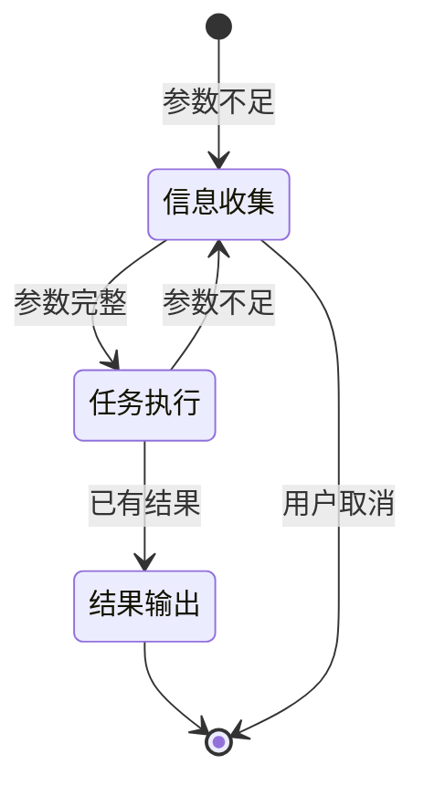

# SKILL 技能体系定义

## 1. 技能总览

| 技能ID | 技能名称 | 触发词示例 | 优先级 | 状态 |
|--------|---------|-----------|--------|------|
| SKL001 | track_waybill | 查单、追踪、运单、到哪了 | 10 | 启用 |
| SKL002 | quote_price | 报价、价格、多少钱 | 20 | 启用 |
| SKL003 | query_inventory | 库存、有货、多少件 | 30 | 启用 |
| SKL004 | create_order | 下单、创建订单 | 40 | 启用 |
| SKL005 | search_knowledge | SOP、怎么操作、流程 | 50 | 启用 |
| SKL006 | customer_info | 客户信息、账号 | 60 | 启用 |
| SKL007 | proactive_customer_contact | 主动联系客户、运单异常、安抚 | 70 | 启用 |

---

## 2. 参数 Slot 规则

### 2.1 任务与必填参数

| 任务类型 | 必填参数 | 可选参数 |
|---------|---------|---------|
| 查单 (track_waybill) | waybill_no | - |
| 报价 (quote_price) | weight, country | service_type, origin_country |
| 库存 (query_inventory) | warehouse_id, sku | - |
| 订单 (create_order) | customer_id, items | receiver_info, remarks |
| 知识检索 (search_knowledge) | keywords | category, limit |
| 客户信息 (customer_info) | customer_id | - |

### 2.2 参数继承规则

- **同一任务内**允许复用已有参数
- **禁止跨任务**使用参数（如：查单拿到 waybill_no 后，不能直接用于报价）
- 任务切换时自动重置 Slot

### 2.3 参数不足处理

```
❗ 禁止执行
❗ 禁止猜测

输出格式：
请提供：缺失参数1、缺失参数2
```

---

## 3. 技能详细定义

### 3.1 SKL001 - 运单追踪 (track_waybill)

**触发条件：**
```json
{
  "keywords": ["查单", "追踪", "运单", "物流", "到哪了", "什么状态"],
  "exclude_keywords": [],
  "required_params": ["waybill_no"]
}
```

**响应模板：**
```
【当前判断】
该运单 {waybill_no} 当前位于 {current_location}

【运单状态】
{status} - {status_desc}

【物流轨迹】
{tracking_history}

【关键依据】
- 运单号：{waybill_no}
- 目的地：{dest_country}
- 预计到达：{eta}

【风险提示】（如有）
{exception_info}
```

**示例对话：**
- 输入：帮我查一下运单 WB20260328001
- 输出：触发 track_waybill，参数 waybill_no

---

### 3.2 SKL002 - 运费报价 (quote_price)

**触发条件：**
```json
{
  "keywords": ["报价", "价格", "多少钱", "费用", "运费"],
  "exclude_keywords": ["历史", "查询"],
  "required_params": ["weight", "country"],
  "optional_params": ["service_type", "origin_country"]
}
```

**响应模板：**
```
【当前判断】
{weight}KG 货物发往 {country}，{service_type} 报价如下

【报价明细】
- 运费：{shipping_fee} 元
- 基础费用：{base_fee} 元
- 附加费：{surcharge} 元
- 合计：{total} 元

【报价依据】
- 单价：{unit_price} 元/KG
- 重量：{weight}KG
- 目的地：{country}

【有效期】
报价有效期至 {expiry_date}

【风险提示】（如有）
{price_risk}
```

**示例对话：**
- 输入：发到美国 5 公斤多少钱
- 输出：触发 quote_price，参数 weight=5, country=美国

---

### 3.3 SKL003 - 库存查询 (query_inventory)

**触发条件：**
```json
{
  "keywords": ["库存", "有货", "多少件", "库存量"],
  "exclude_keywords": ["历史", "统计"],
  "required_params": ["warehouse_id", "sku"]
}
```

**响应模板：**
```
【当前判断】
仓库 {warehouse_name} 中 SKU {sku} 库存情况

【库存明细】
- 总数量：{quantity} {unit}
- 预留：{reserved} {unit}
- 可用：{available} {unit}

【货位信息】
{shelf_location}

【关键依据】
- 仓库：{warehouse_name}（{warehouse_id}）
- SKU：{sku}
- 最后更新：{updated_at}

【行动建议】
{next_action}
```

---

### 3.4 SKL004 - 创建订单 (create_order)

**触发条件：**
```json
{
  "keywords": ["下单", "创建订单", "新订单", "要发货"],
  "exclude_keywords": ["查询", "修改"],
  "required_params": ["customer_id", "items"],
  "optional_params": ["receiver_info", "remarks"]
}
```

**响应模板：**
```
【当前判断】
为客户 {customer_name} 创建新订单

【订单信息】
- 订单号：{order_no}
- 客户：{customer_name}
- 商品：{items_summary}
- 总金额：{total_amount} {currency}

【收货信息】
- 收货人：{receiver_name}
- 地址：{receiver_address}
- 国家：{receiver_country}

【操作状态】
{create_status}

【后续操作】
1. 确认订单信息
2. 选择仓库
3. 生成运单
```

---

### 3.5 SKL005 - 知识检索 (search_knowledge)

**触发条件：**
```json
{
  "keywords": ["怎么操作", "SOP", "流程", "政策", "是什么", "如何处理"],
  "exclude_keywords": [],
  "required_params": ["keywords"],
  "optional_params": ["category", "limit"]
}
```

**响应模板：**
```
【当前判断】
关于 "{keywords}" 的检索结果

【匹配知识】
{knowledge_content}

【来源】
- 分类：{category}
- 来源：{source}
- 置信度：{confidence}%

【操作建议】
{actionable_steps}
```

**外部信息标注：**
```
【外部参考】
来源：{external_source}
链接：{url}
注：此信息来自外部检索，建议核实后并入知识库
```

---

### 3.6 SKL006 - 客户信息 (customer_info)

**触发条件：**
```json
{
  "keywords": ["客户信息", "账号", "联系人", "客户资料"],
  "exclude_keywords": [],
  "required_params": ["customer_id"],
  "optional_params": []
}
```

**响应模板：**
```
【当前判断】
客户 {customer_name} 基本信息

【客户档案】
- 客户ID：{customer_id}
- 客户名称：{customer_name}
- 联系人：{contact_name}
- 联系方式：{contact_phone}（脱敏）
- 客户等级：{tier}
- 客户经理：{account_manager}
- 信用额度：{credit_limit}

【状态】
{status}

【最近订单】
{recent_orders_summary}

【建议操作】
{next_action}
```

---

### 3.7 SKL007 - 主动联系客户 (proactive_customer_contact)

**触发条件：**
```json
{
  "keywords": ["主动联系", "运单异常", "安抚客户", "异常通知"],
  "exclude_keywords": [],
  "required_params": ["waybill_no", "exception_type", "trigger_mode"],
  "optional_params": ["solution_options", "compensation", "eta"]
}
```

**响应模板：**
```
【当前判断】
运单 {waybill_no} 发生异常，需要主动联系客户进行安抚

【异常情况】
- 异常类型：{exception_type}
- 异常原因：{exception_reason}
- 当前状态：{current_status}

【安抚话术】
{message_content}

【解决方案】
1. {solution_1}
2. {solution_2}
3. {solution_3}

【预计时间】
{eta}

【补偿方案】（如有）
{compensation}

【后续操作】
{next_action}

【发送渠道】
企业微信

【升级机制】
触发条件：客户持续负面情绪 / 多次追问 / 明确要求人工
操作：自动转人工客服介入
```

**示例对话：**
- 自动触发：运单状态变为 EXCEPTION → AI 生成安抚话术 → 员工确认 → 发送客户
- 手动触发：员工选择运单 → 标记"需要主动联系" → AI 生成话术 → 员工确认 → 发送客户

**升级对话示例：**
- 客户：多次追问未解决 → 系统提示"正在为您转接人工客服..."
- 客户："我要人工" → 直接转人工

**状态机：**
```
[*] --> 生成话术 : 触发主动联系
生成话术 --> 员工确认 : AI 生成完成
员工确认 --> 发送消息 : 员工批准
员工确认 --> 生成话术 : 驳回修改
发送消息 --> 双向对话 : 客户收到消息
双向对话 --> 等待回复 : 客户未回复
等待回复 --> 理解回复 : 客户回复
理解回复 --> 执行操作 : 理解意图
执行操作 --> 双向对话 : 处理完成
执行操作 --> 转人工 : 升级条件触发
转人工 --> [*] : 交接人工客服
```

**禁忌行为：**
- ❌ 未经员工确认直接发送
- ❌ 不提供解决方案只道歉
- ❌ 承诺无法兑现的时间
- ❌ 客户要求人工时继续机器人回复

---

## 4. 状态机设计

### 4.1 三种状态



### 4.2 状态行为

| 状态 | 触发 | 行为 |
|------|------|------|
| **信息收集** | 参数不足 | 只提问，不输出结论 |
| **任务执行** | 参数完整 | 调用 SKILL/系统 |
| **结果输出** | 已有结果 | 输出决策+操作建议 |

---

## 5. 输出格式规范

### 5.1 标准执行格式

```markdown
【当前判断】
一句话说明当前情况

【建议操作】
1. 第一步
2. 第二步
3. 是否需要升级（如有）

【关键依据】
- 数据或规则来源

【风险提示】（如有）
- 风险说明
```

### 5.2 信息收集格式

```markdown
请提供：缺失参数
```

### 5.3 异常格式

| 异常类型 | 输出 |
|---------|------|
| 系统暂不可用 | `【⚠️ 系统暂不可用，请稍后重试】` |
| 信息不足 | `【信息不足，无法判断】` + `请补充：xxx` |
| 数据冲突 | `【❓ 数据冲突，待核实】` |

---

## 6. 禁用行为

| 禁用项 | 说明 |
|--------|------|
| ❌ 猜测缺失参数 | 参数不足必须询问 |
| ❌ 跨任务复用参数 | 每次任务切换重置 Slot |
| ❌ 绕过 SKILL 直接推理 | 必须优先匹配技能 |
| ❌ 输出模糊建议 | 必须具体可执行 |
| ❌ 仅复述数据 | 必须提供行动建议 |
