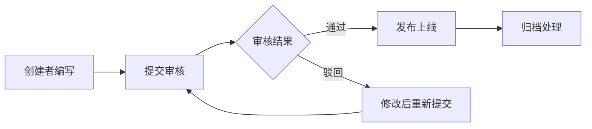

# 知识库体系设计

## 1. 知识分类体系

### 1.1 一级分类

| 分类代码 | 分类名称 | 说明 | 示例 |
|---------|---------|------|------|
| FAQ | 常见问题 | 员工/客户常见问题解答 | 怎么修改密码 |
| SOP | 标准流程 | 标准操作规程 | 入库流程 |
| POLICY | 政策制度 | 公司政策、法规 | 报销制度 |
| COMPETITOR | 竞品分析 | 竞品对比分析 | DHL vs FedEx |
| INDUSTRY | 行业知识 | 行业动态、通识 | 航空货运知识 |
| PRODUCT | 产品知识 | 产品规格、参数 | 某型号打印机 |
| OTHER | 其他 | 不属于以上类别 | 公告通知 |

### 1.2 二级分类示例

| 一级分类 | 二级分类示例 |
|---------|------------|
| FAQ | 账号问题、支付问题、 shipping 问题 |
| SOP | 入库流程、出库流程、退件流程、报销流程 |
| POLICY | 考勤制度、报销制度、保密制度 |
| COMPETITOR | FedEx、DHL、UPS、TNT |
| INDUSTRY | 航空、海运、陆运、清关 |
| PRODUCT | 国际快递、仓储服务、定制物流 |

---

## 2. 知识条目结构

### 2.1 知识条目模板

```json
{
  "kb_id": "KB00001",
  "category": "SOP",
  "subcategory": "入库流程",
  "title": "国际快递入库操作流程",
  "content": "## 目的\n明确国际快递入库操作标准...\n\n## 适用范围\n... \n\n## 操作步骤\n1. 接收包裹\n2. 登记信息\n3. 扫描入库\n\n## 注意事项\n...",
  "summary": "国际快递入库操作的标准流程",
  "tags": ["入库", "国际快递", "操作"],
  "confidence": 0.95,
  "source": "INTERNAL",
  "author": "仓库部",
  "status": "PUBLISHED",
  "created_by": "USR001",
  "approved_by": "USR002",
  "created_at": "2026-03-01 10:00:00",
  "updated_at": "2026-03-01 10:00:00",
  "published_at": "2026-03-01 10:00:00"
}
```

### 2.2 字段说明

| 字段 | 类型 | 必填 | 说明 |
|------|------|------|------|
| kb_id | VARCHAR(32) | 是 | 知识ID，系统自动生成 |
| category | ENUM | 是 | 一级分类 |
| subcategory | VARCHAR(64) | 否 | 二级分类 |
| title | VARCHAR(256) | 是 | 知识标题 |
| content | TEXT | 是 | 知识正文（支持 Markdown） |
| summary | VARCHAR(512) | 否 | 摘要（用于检索展示） |
| tags | JSON | 否 | 标签数组 |
| confidence | DECIMAL | 否 | 置信度（0-1） |
| source | VARCHAR(32) | 否 | 来源：INTERNAL/EXTERNAL |
| source_url | VARCHAR(512) | 否 | 原文链接 |
| author | VARCHAR(64) | 否 | 作者 |
| status | ENUM | 是 | 状态：DRAFT/PUBLISHED/ARCHIVED |
| created_by | VARCHAR(32) | 是 | 创建人 |
| approved_by | VARCHAR(32) | 否 | 审核人 |
| created_at | TIMESTAMP | 是 | 创建时间 |
| updated_at | TIMESTAMP | 是 | 更新时间 |
| published_at | TIMESTAMP | 否 | 发布时间 |

---

## 3. 知识录入流程

### 3.1 提交流程



### 3.2 状态流转

```
DRAFT → PUBLISHED → ARCHIVED
  ↑_________|         |
       驳回后修改        |
                      最终状态
```

| 状态 | 说明 | 可执行操作 |
|------|------|-----------|
| DRAFT | 草稿状态 | 编辑、删除、提交审核 |
| PUBLISHED | 已发布 | 编辑（需重新审核）、归档 |
| ARCHIVED | 已归档 | 仅查看，不可编辑 |

### 3.3 角色权限

| 角色 | 可创建 | 可审核 | 可发布 | 可归档 |
|------|--------|--------|--------|--------|
| 管理员 | ✓ | ✓ | ✓ | ✓ |
| 仓库员工 | ✓（SOP/FAQ） | ✗ | ✗ | ✗ |
| 客服 | ✓（FAQ） | ✗ | ✗ | ✗ |
| 销售 | ✓（产品/竞品） | ✗ | ✗ | ✗ |

---

## 4. 知识质量标准

### 4.1 内容质量标准

| 维度 | 要求 | 检查项 |
|------|------|--------|
| 完整性 | 内容无缺失 | 包含目的、范围、步骤、注意事项 |
| 准确性 | 信息正确无误 | 审核人确认、版本管理 |
| 时效性 | 内容不过期 | 定期Review、到期提醒 |
| 可读性 | 易于理解 | 结构清晰、格式规范 |
| 可操作性 | 能指导行动 | 步骤明确、结果可验证 |

### 4.2 格式规范

**标题规范：**
- 一级标题：文章标题
- 二级标题：主要章节
- 三级标题：具体步骤

**内容结构：**
```
## 标题

### 目的/背景
简要说明...

### 适用范围
...

### 操作步骤
1. 第一步
2. 第二步
3. 第三步

### 注意事项
...

### 相关文档
- 相关知识链接
```

### 4.3 质量评分

| 评分维度 | 权重 | 评分标准 |
|---------|------|---------|
| 内容完整性 | 30% | 每缺失一项扣10分 |
| 格式规范性 | 20% | 按格式规范检查 |
| 时效性 | 20% | 超过6个月未更新扣分 |
| 准确性 | 20% | 错误被发现一次扣20分 |
| 可读性 | 10% | 主观评价 |

---

## 5. 知识检索策略

### 5.1 检索优先级

```
1. 精确匹配 → 2. 模糊匹配 → 3. 向量相似度 → 4. 外部补充
```

### 5.2 检索参数

| 参数 | 类型 | 说明 |
|------|------|------|
| keywords | STRING | 检索关键词 |
| category | ENUM | 按分类筛选 |
| status | ENUM | 状态筛选，默认 PUBLISHED |
| limit | INT | 返回数量，默认 5 |
| offset | INT | 分页偏移 |
| date_from | DATE | 时间范围起 |
| date_to | DATE | 时间范围止 |

### 5.3 返回排序

| 排序方式 | 说明 |
|---------|------|
| relevance | 相关度（默认） |
| created_at | 按创建时间 |
| view_count | 按浏览量 |
| useful_count | 按点赞数 |

---

## 6. 知识运营指标

### 6.1 核心指标

| 指标 | 定义 | 目标值 |
|------|------|--------|
| 知识覆盖率 | 有知识覆盖的任务类型/总任务类型 | > 90% |
| 平均检索满意度 | 用户评价均值 | > 4.0/5 |
| 知识更新及时率 | 过期知识及时更新比例 | > 95% |
| 检索响应时长 | P95 响应时间 | < 500ms |

### 6.2 定期Review

| Review 类型 | 频率 | 负责人 |
|-----------|------|--------|
| 内容自查 | 每月 | 知识作者 |
| 质量抽查 | 每季度 | 质量部 |
| 全面Review | 每年 | 知识委员会 |

---

## 7. 知识贡献激励

### 7.1 积分规则

| 行为 | 积分 |
|------|------|
| 创建知识并发布 | +10 |
| 知识被评价为有用 | +2/次 |
| 知识被引用 | +5/次 |
| 发现错误被采纳修正 | +8 |

### 7.2 排行榜

- 月度知识贡献榜
- 年度最佳知识贡献奖
- 知识质量之星

---

## 8. 知识库扩容计划

### 阶段一（基础）
- FAQ 常见问题（50条）
- 核心 SOP（20条）
- 基本政策（10条）

### 阶段二（扩展）
- 全流程 SOP（50条）
- 竞品分析（10份）
- 产品知识（30条）

### 阶段三（完善）
- 行业知识库（100条）
- 历史案例库（50条）
- 培训课件（20份）
