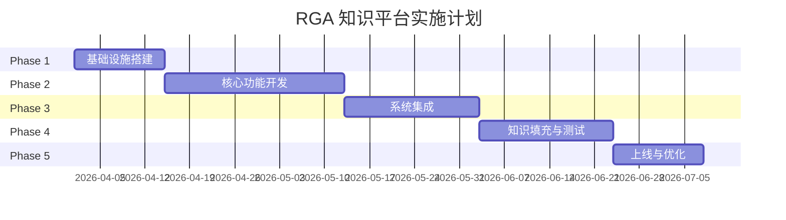

# 实施路线图

## 1. 项目概述

### 1.1 项目目标

构建 RGA 综合知识平台，为 AI 中台智能体 Nexus 提供知识支撑，实现：
- 知识统一管理（SOP/FAQ/政策/竞品）
- 智能化技能匹配（SKILL Engine）
- 实时业务数据对接（WMS/OMS/TMS）

### 1.2 项目范围

| 范围 | 内容 |
|------|------|
| 数据层 | MySQL 数据库、缓存、向量库 |
| 服务层 | API 服务、SKILL 引擎、知识检索 |
| 接口层 | REST API、企业微信 Bot、钉钉 Bot |
| 管理后台 | 知识管理、用户管理、运营报表 |

---

## 2. 实施阶段

### Phase 1：基础设施搭建（2周）

**目标：** 完成数据库搭建、基础框架搭建

| 序号 | 任务 | 交付物 | 负责人 |
|------|------|--------|--------|
| 1.1 | MySQL 环境部署 | 数据库服务 | 运维 |
| 1.2 | 执行建表 SQL | 10张数据表 | 后端 |
| 1.3 | 初始化数据导入 | 基础数据 | 后端 |
| 1.4 | Redis 部署 | 缓存服务 | 运维 |
| 1.5 | 项目框架搭建 | 基础代码结构 | 后端 |
| 1.6 | API 骨架编写 | REST API 基础 | 后端 |

**里程碑：** M1 - 数据库和基础框架就绪

---

### Phase 2：核心功能开发（4周）

**目标：** 完成 SKILL 引擎、知识库、核心 API

| 序号 | 任务 | 交付物 | 负责人 |
|------|------|--------|--------|
| 2.1 | SKILL 引擎开发 | 技能匹配模块 | 后端 |
| 2.2 | 意图识别模块 | 意图分类器 | 算法 |
| 2.3 | 知识库管理功能 | 知识 CRUD | 全栈 |
| 2.4 | 知识检索功能 | 搜索引擎 | 后端 |
| 2.5 | 运单查询 API | /api/waybill/* | 后端 |
| 2.6 | 库存查询 API | /api/inventory/* | 后端 |
| 2.7 | 报价计算 API | /api/pricing/* | 后端 |
| 2.8 | 知识库界面 | 管理后台 | 前端 |

**里程碑：** M2 - 核心业务功能可用

---

### Phase 3：系统集成（3周）

**目标：** 完成外部系统对接、管理后台

| 序号 | 任务 | 交付物 | 负责人 |
|------|------|--------|--------|
| 3.1 | WMS 系统对接 | WMS 接口 | 后端 |
| 3.2 | OMS 系统对接 | OMS 接口 | 后端 |
| 3.3 | TMS 系统对接 | TMS 接口 | 后端 |
| 3.4 | 企业微信 Bot | 微信端 | 全栈 |
| 3.5 | 钉钉 Bot | 钉钉端 | 全栈 |
| 3.6 | 管理后台-用户管理 | 用户CRUD | 前端 |
| 3.7 | 管理后台-权限管理 | RBAC | 前端 |
| 3.8 | 管理后台-运营报表 | 统计图表 | 前端 |

**里程碑：** M3 - 系统集成完成

---

### Phase 4：知识库填充与测试（3周）

**目标：** 完成知识填充、系统测试

| 序号 | 任务 | 交付物 | 负责人 |
|------|------|--------|--------|
| 4.1 | FAQ 知识录入 | 50条FAQ | 运营 |
| 4.2 | SOP 知识录入 | 20个SOP | 运营 |
| 4.3 | 政策制度录入 | 10个政策 | 运营 |
| 4.4 | 竞品分析录入 | 5份分析 | 运营 |
| 4.5 | 功能测试 | 测试报告 | 测试 |
| 4.6 | 性能测试 | 性能报告 | 测试 |
| 4.7 | 安全测试 | 安全报告 | 测试 |
| 4.8 | 用户验收测试 | UAT报告 | 业务 |

**里程碑：** M4 - 知识就绪、测试通过

---

### Phase 5：上线与优化（2周）

**目标：** 正式上线、持续优化

| 序号 | 任务 | 交付物 | 负责人 |
|------|------|--------|--------|
| 5.1 | 部署上线 | 生产环境 | 运维 |
| 5.2 | 灰度发布 | 灰度方案 | 运维 |
| 5.3 | 全量上线 | 正式版本 | 运维 |
| 5.4 | 用户培训 | 培训材料 | 运营 |
| 5.5 | 知识运营 | 运营规范 | 运营 |
| 5.6 | 问题修复 | Bug修复 | 开发 |
| 5.7 | 性能优化 | 优化方案 | 开发 |

**里程碑：** M5 - 正式上线运营

---

## 3. 资源估算

### 3.1 人力投入

| 角色 | Phase1 | Phase2 | Phase3 | Phase4 | Phase5 | 合计 |
|------|--------|--------|--------|--------|--------|------|
| 后端开发 | 1 | 2 | 2 | 1 | 1 | 7人周 |
| 前端开发 | 0 | 1 | 2 | 1 | 1 | 5人周 |
| 测试 | 0 | 0 | 0 | 2 | 1 | 3人周 |
| 运维 | 1 | 0 | 1 | 0 | 2 | 4人周 |
| 运营/业务 | 0 | 0 | 0 | 2 | 2 | 4人周 |
| **合计** | **2** | **3** | **5** | **6** | **7** | **23人周** |

### 3.2 服务器资源

| 资源 | 规格 | 数量 | 说明 |
|------|------|------|------|
| API 服务器 | 2核4G | 2 | 主备 |
| 数据库 | 4核8G 100G SSD | 1 | MySQL |
| Redis | 2核4G | 1 | 缓存 |
| 向量库(可选) | 4核8G | 1 | 语义检索 |

---

## 4. 风险评估

| 风险项 | 影响 | 概率 | 应对措施 |
|--------|------|------|---------|
| 外部系统对接延迟 | 高 | 中 | 预留2周buffer |
| 知识录入进度慢 | 中 | 高 | 提前启动、培训专人 |
| 性能不达标 | 中 | 低 | Phase2预留优化时间 |
| 用户接受度低 | 中 | 中 | 充分培训、收集反馈 |
| 数据质量差 | 高 | 中 | 建立质量审核机制 |

---

## 5. 里程碑总览

| 里程碑 | 预计日期 | 交付内容 |
|--------|---------|---------|
| M1 基础就绪 | 2026-04-14 | DB、框架、基础API |
| M2 功能可用 | 2026-05-12 | SKILL引擎、知识库、核心API |
| M3 集成完成 | 2026-06-02 | 外部系统对接、Bot上线 |
| M4 测试通过 | 2026-06-23 | 知识就绪、测试完成 |
| M5 正式上线 | 2026-07-07 | 生产上线、用户培训 |

---

## 6. 成功标准

### 6.1 功能标准

- [ ] 10张数据表正常运转
- [ ] 6个 SKILL 技能正常触发
- [ ] 知识检索召回率 > 90%
- [ ] API 响应时间 P95 < 500ms

### 6.2 业务标准

- [ ] FAQ 覆盖常见问题 > 50条
- [ ] SOP 覆盖核心流程 > 20个
- [ ] 用户满意度 > 4.0/5

### 6.3 运维标准

- [ ] 系统可用性 > 99.9%
- [ ] 无重大安全事故
- [ ] 文档齐全可交接

---

## 7. 后续迭代计划

### V1.1（上线后1个月）
- 用户反馈优化
- 高频问题补充
- Bug修复

### V1.2（上线后3个月）
- 向量检索能力增强
- 多语言支持
- 移动端优化

### V2.0（上线后6个月）
- AI 对话能力增强
- 智能推荐
- 数据分析挖掘
